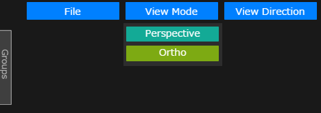
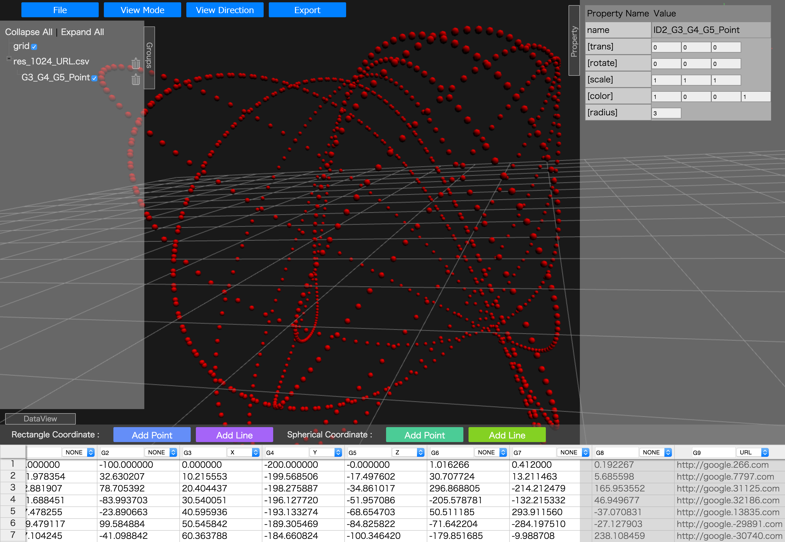

#利用説明書

##目次

* [第1章 はじめに](#hajimeni)

	* [動作環境](#dousagaiyou)
	* [機能概要](#kinougaiyou)
	* [インストール](#install)
	* [起動方法](#kidouhouhou)

# 

* [第2章 機能](#kinou)

	* [画面構成](#gamenkousei)
	* [Openボタン](#openbutton)
	* [ViewModeボタン](#viewmodebutton)
	* [ViewDirectionボタン](#viewdirectionbutton)
	* [Exportボタン](#exportbutton)
	* [View画面](#viewgamen)
	* [Groupsウィンドウ](#groupswindow)
	* [DataViewウィンドウ](#dataviewwindow)
	* [Propertyウィンドウ](#propertywindow)

 
 

## [第1章 はじめに](id:hajimeni)

---
本書は設計解探査システムのプロトタイプ(以降, WebGL View)の操作方法について解説するものです.

### [動作環境](id:dousakankyou)
WebGL View は以下の環境で動作します.

OS : Linux, Windows(Vista,7,8), MacOSX  
Webブラウザ: Mozilla Firefox, Google Chrome, Apple Safari

### [機能概要](id:kinougaiyou)
WebGL View の主な機能は以下の通りです.

* STL (バイナリ形式,アスキー形式) を読み込み, 表示します.
* CSV を読み込み, 選択した形式 (点, ライン) で表示します.

### [インストール](id:install)

###### Node.js のインストール
WebGL View の動作には Node.js のインストールが必要です.  
Node.js の公式サイト [http://nodejs.org](http://nodejs.org) から Node.js 本体をダウンロードし, インストールします.

###### WebGL View の準備
インストールCD からXXXXX.zipをローカルディスクにコピーし, 展開します. 

### [起動方法](id:kidouhouhou)
###### 単体利用での起動

Webブラウザで index.html ファイルを開きます.

###### データベースと連携機能を利用するための起動

(1) terminal から以下のコマンドを実行します.  ただし, nodeにpathが通っている必要があります.

	$node server.js
	
(2) ブラウザにて, localhostにアクセスします. URLは通常は以下のようになります.

	http://localhost:8080

 
 
## [第2章 機能](id:kinou)
---

### [画面構成](id:gamenkousei)
WebGL View の画面構成は下記のとおりです.

### [Fileボタン](id:openbutton)
各種ファイルをロードすることができます.  
プルダウン時に表示されるボタンの動作は以下のとおりです.  

* Open STL : STLファイル (binary, text形式) をロードします.
* Open CSV : テキストデータをロードします. ロードすると, 後述するDataViewウィンドウに反映されます.
* Open URL : URLからテキストデータをロードします. ロードすると, 後述するDataViewウィンドウに反映されます.

### [ViewModeボタン](id:viewmodebutton)
View画面の透視投影, 平行投影を切り替えることができます.

* Perspective : 透視投影にてViewを行います.
* Ortho       : 平行投影にてViewを行います.

### [ViewDirectionボタン](id:viewdirectionbutton)
指定された軸(プレフィクスビュー)にてView画面を切り替えることができます.  
プルダウン時に表示されるボタンの動作は下記のとおりです.

|ボタン|動作|
|--|--|
| Front  / Z+  | Z軸+方向からのビューに切り替えます.
| Left   / X+  | X軸+方向からのビューに切り替えます.
| Top    / Y+  | Y軸+方向からのビューに切り替えます.
| Back   / Z-  | Z軸-方向からのビューに切り替えます.
| Right  / X-  | X軸-方向からのビューに切り替えます.
| Bottom / Y-  | Y軸+方向からのビューに切り替えます.

* Front / Back ビュー

* Left / Right ビュー
 

* Top / Bottom ビュー
 

### [Export Sceneボタン](id:exportbutton)
現在可視化されているカメラアングル、オブジェクトを、HIVEにてレンダリングできる形式でExportします.
押下すると、.scn(シーンファイル)をダウンロードすることができます.

### [View画面](id:viewgamen)
可視化された2D, 3Dオブジェクトを表示する画面です.

グリッドのサイズは3D空間上の単位で100 (固定) です。また, マウス操作にてオブジェクトのビューの操作を行うことができます.  
マウス操作方法を以下に示します.

###### マウス操作
|マウス|ビュー|
|--|--|
|左クリックドラッグ | 回転(原点)
|右クリックドラッグ | 移動
|中クリックドラッグ | ズーム
|中ホイール        | ズーム

### [Groupsウィンドウ](id:groupswindow)
Groupsウィンドウは, ロード, 追加されたオブジェクトの管理を行います.  
対象のデータは以下のとおりです.

* STLデータ
* テキスト, CSV(以降, テキストデータと記載)データ
* Groupデータ

操作方法を以下に示します.

* チェックボックスのチェックをはずすと, オブジェクトがViewから消えます.
* チェックを入れると再びオブジェクトが表示されます.
* ゴミ箱ボタンを押下すると, オブジェクトは削除されます.  
ただし, ID0_gridは表示基準となるオブジェクトのため, 消去できません.
* テキストデータを押下すると, DataViewウィンドウに反映されます.
* STLデータ, Groupデータを押下すると, View画面に対象の3Dオブジェクトが表示され, 自動的にスナップします.
* GroupsタブはワンクリックでOpen/Closeできます. またドラッグでウィンドウサイズが変更できます.

### [DataViewウィンドウ](id:dataviewwindow)
読み込んだテキストデータを表示し, 可視化対象の列成分の選択を行います.

G0, G1と記載された箇所は,列の名前を表します.  
デフォルト名は G0, G1...Gn です.  
名前は変更することができ, かつ名前は重複可能です.

列選択を行うには, NONEと記載されたプルダウンメニューを使用します.  
プルダウンにて表示される値の意味は下記のとおりです.

* X  :列をX軸データとして選択します.
* Y  :列をY軸データとして選択します.
* Z  :列をZ軸データとして選択します.
* URL:列をURLデータとして選択します.

同じ可視化内容を重複して選択した場合は, 左側の列が優先されます.

#### Rectangle Coordinate

###### Add Pointボタン  
選択したテキストデータのPointモデルで、直交座標での可視化を行います.

###### Add Lineボタン  
テキストデータのLineモデルで、直交座標での可視化を行います.  
Lineモデルは現状は離散線分形式となります.

#### Spherical Coordinate

###### Add Pointボタン  
選択したテキストデータのPointモデルで、球座標系での可視化を行います.

###### Add Lineボタン  
テキストデータのLineモデルで、、球座標系での可視化を行います.  
Lineモデルは現状は離散線分形式となります.

凡例を以下に示します.

* X, Y, Z, URLを選択し, Rectangle CoordinateのAdd PointにてView画面にPointモデルで可視化された3Dオブジェクトが表示されます.

* X, Yを選択し, Rectangle CoordinateのAdd LineにてView画面にLineモデルで可視化された3Dオブジェクトが表示されます.

###### データのピック方法
Add Pointで生成されたデータは, マウス操作 (左クリック) にてピックすることができます.  
ピックした凡例を以下に示します.

### [Propertyウィンドウ](id:propertywindow)
Groupsウィンドウで選択したオブジェクトのプロパティを表示します.  

設定可能なプロパティは下記のとおりです.

###### name : 名前 
オブジェクトの名前を表します.

###### [trans] : 平行移動成分
左からX方向移動, Y方向移動, Z方向移動を表します.  
デフォルト値は (0, 0, 0), 単位は3DView空間座標に依存します.

###### [rotate] : 回転成分
左からX軸中心回転, Y軸中心回転, Z軸中心回転を表します.  
デフォルト値は (0, 0, 0), 単位はradianです.

###### [scale] : 拡大縮小成分
左からX方向スケール, Y方向スケール, Z方向スケールを表します.  
デフォルト値は (1, 1, 1) です.

###### [color] : カラー成分
左からR, G, B, A成分を表します.  
デフォルト値は (1, 1, 1, 1) です.

###### [radius] : 半径成分
非STLデータの場合のみ設定可能です.  
デフォルト値は 1.0, 単位は3DView空間座標に依存します.

